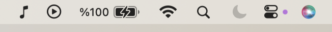
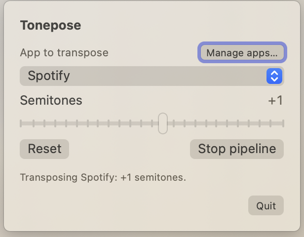

### tonepose

Pitch-shift audio from **Spotify, Apple Music, browsers, and more**, from the menu bar. **No BlackHole or virtual cables.** Free and open-source.

<p align="center">
  <a href="https://github.com/metezem/tonepose/releases/download/v1.0.0/tonepose-1.0.0.dmg"></a>
</p>

<p align="center">
  <a href="https://github.com/metezem/tonepose/releases/latest"></a>
  <a href="https://github.com/metezem/tonepose/releases"></a>
  <a href="LICENSE"></a>
  <a href="https://www.apple.com/macos/"></a>
</p>

## Install

Download the latest **`.dmg`** from **[Releases](https://github.com/metezem/tonepose/releases/latest)**, open it, and drag **tonepose.app** into **Applications**.

To build from source instead, see below.

## Quick start

1. Open **tonepose** from **Applications**.
2. Allow **audio capture** when macOS asks.
3. Click the **♪** (music note) icon in the menu bar to open the panel, then choose a running app on the quick list.
4. Set **semitones** (−12 … +12); each app keeps its own value.
5. Use **tonepose — apps** in the popover to pin extra processes.

If the source app drops off the audio graph while idle, reconnect by playing audio again.

## Screenshots

tonepose lives in the menu bar. After launch, click the **♪** icon to open the popover.

<p align="center">
  
</p>

The panel: pick the app to transpose, adjust semitones, manage apps, and control the pipeline.

<p align="center">
  
</p>

## Features

- **Per-app transpose** — Saved per unique app.
- **Quick list** — Common music apps and browsers when they’re running; pin others from the apps window.
- **Menu bar** — Popover + optional **tonepose — apps** window; **Quit** in the popover.
- **Pipeline** — Stop / start when you need a clean reconnect.

## Contributing

Issues and PRs welcome. To build locally:

```bash
git clone https://github.com/metezem/tonepose.git
cd tonepose
open tonepose.xcodeproj
```

**tonepose** scheme, then **Run** (⌘R). Or:

```bash
xcodebuild -project tonepose.xcodeproj -scheme tonepose -configuration Debug -derivedDataPath ./DerivedData build
```

→ `DerivedData/Build/Products/Debug/tonepose.app`

## Requirements

- **macOS 14.4+**
- **Xcode 15+** (only for building from source)
- **Audio capture** permission (prompted on first use)

## License

[MIT](LICENSE)
